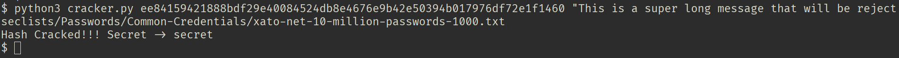

# HMAC-SHA256 Secret Recovery Tool

A lightweight Python command-line tool for recovering HMAC-SHA256 secrets using a dictionary attack when the plaintext message and HMAC digest are known.

---

## Why This Tool Exists

While testing a web application, I discovered an HMAC-SHA256 digest and its corresponding plaintext message exposed in a JavaScript file. My goal was to recover the secret key used to generate the digest. I initially attempted to use Hashcat, but the message length exceeded Hashcat's supported input limits for this attack, making it unsuitable for the scenario.

To solve the problem, I implemented a lightweight Python tool that performs a dictionary attack against HMAC-SHA256 digests when both the plaintext message and target digest are known. The result is a simple, dependency-free utility that is useful for security research, penetration testing, CTF challenges, and understanding how HMAC verification works.

---

## Why Not Hashcat?

Hashcat is an excellent and highly optimized password recovery tool that supports numerous hashing and HMAC algorithms. However, it is designed for specific attack modes and input formats.

In situations where the plaintext message is already known but is too large or does not fit Hashcat's expected input format, using Hashcat can become impractical. For these cases, a lightweight Python implementation is often easier to understand, modify, and adapt to custom workflows.

This project is **not** intended to replace Hashcat. Instead, it provides a simple and flexible alternative for a narrow use case where readability, portability, and customization are more important than GPU-accelerated performance.

---

## Features

* Recover HMAC-SHA256 secrets using a dictionary attack
* Accepts a known HMAC digest and plaintext message as input
* Reads candidate secrets directly from a wordlist
* Stops immediately when the correct secret is found
* Pure Python implementation with no external dependencies
* Simple command-line interface
* Easy to understand and modify for custom research or educational purposes

---

## Installation

### Prerequisites

* Python 3.8 or later

### Clone the repository

```bash
git clone https://github.com/<username>/hmac_sha256_cracker.git
cd hmac_sha256_cracker
```

### Install dependencies

This project uses only the Python standard library and has no external dependencies.

```bash
pip install -r requirements.txt
```

---

## Usage

```bash
python3 cracker.py <hash> <message> <wordlist>
```

---

## Command-Line Arguments

| Argument   | Description                 |
| ---------- | --------------------------- |
| `hash`     | Target HMAC-SHA256 digest   |
| `message`  | Known plaintext message     |
| `wordlist` | Path to the dictionary file |

---

## Example

```bash
python3 cracker.py ee84159421888bdf29e40084524db8e4676e9b42e50394b017976df72e1f1460 "This is a super long message that will be rejected by hashcat because it is way too long." /usr/share/seclists/Passwords/Common-Credentials/xato-net-10-million-passwords-1000.txt
```

---

## Example Input

The `examples/` directory contains sample files for testing the tool.

| File                  | Description                                                                                                 |
| --------------------- | ----------------------------------------------------------------------------------------------------------- |
| `sample_hash.txt`     | Contains the target HMAC-SHA256 digest.                                                                     |
| `sample_message.txt`  | Contains the plaintext message that was signed to produce the digest.                                       |
| `sample_wordlist.txt` | Contains a small dictionary of candidate secrets. The correct secret is included somewhere within the list. |

---

## Example Output

```text
$ python3 cracker.py ee84159421888bdf29e40084524db8e4676e9b42e50394b017976df72e1f1460 "This is a super long message that will be rejected by hashcat because it is way too long." /usr/share/seclists/Passwords/Common-Credentials/xato-net-10-million-passwords-1000.txt

Hash Cracked!!! Secret -> secret
```

---

## Screenshot



---

## How It Works

The tool performs a dictionary attack against an HMAC-SHA256 digest.

1. Read the target HMAC-SHA256 digest supplied by the user.
2. Read the known plaintext message.
3. Load each candidate secret from the supplied wordlist.
4. Compute an HMAC-SHA256 digest for the known message using each candidate secret.
5. Compare the generated digest with the target digest.
6. If a match is found, display the recovered secret and terminate.
7. If no match is found, report that the supplied wordlist does not contain the correct secret.

---

## Limitations

* Supports only the HMAC-SHA256 algorithm.
* Performs dictionary attacks only.
* CPU-based implementation with no GPU acceleration.
* The secret can only be recovered if it exists in the supplied wordlist.
* Performance depends on the size of the wordlist and available CPU resources.
* Intended as an educational and security research tool rather than a replacement for specialized password recovery frameworks.

---

## Project Status

This project is feature-complete and is not expected to receive additional functionality beyond maintenance updates.

---

## License

This project is licensed under the MIT License. See the `LICENSE` file for details.
